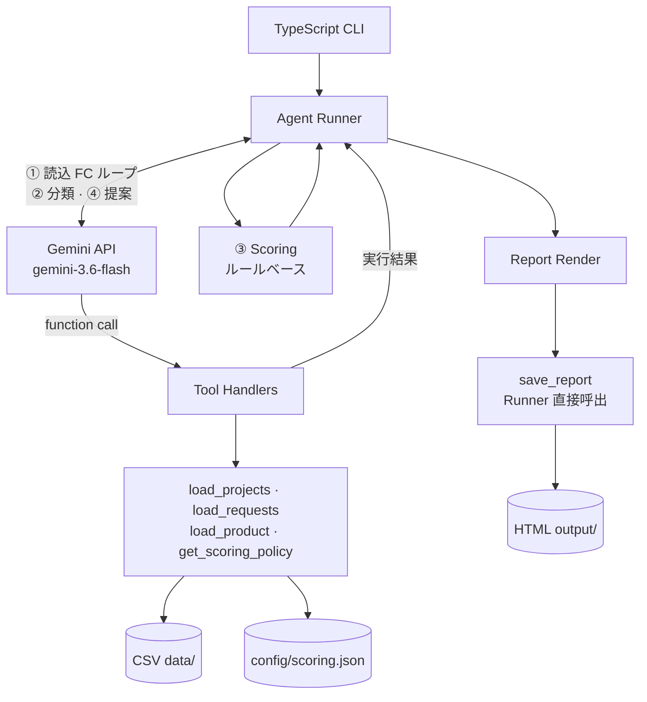

# 複数案件の要望から次の開発を提案する AI エージェント

## 1. 概要

運用中のサービス・パッケージについて、複数案件に散らばった顧客要望を横断整理し、「次に何を作るか」を根拠つきの **HTML 提案レポート** として返す TypeScript CLI エージェントです。案件属性（年間利益・顧客ランク・契約状況）から優先度をルールで算出し、プロダクト情報を参照して新規追加か既存改善かを判断します。最終的な採否は人（PdM）が行います。

題材プロダクト: **MCP Manager**（サンプルは `data/sample/` の架空 CSV）

---

## 2. 想定ユーザーと業務課題

- **想定ユーザー:** プロダクトマネージャー（PdM）。週次の優先度会議前に、複数案件の要望を横断整理する立場の人。
- **困っている業務:**
  - 要望が案件・入手元ごとに分断され、横断比較が難しい
  - 表現が違う同じ要望が重複して数えられる
  - 年間利益・契約状況を踏まえた優先度が属人的
  - 既存機能の改善か新機能かの判断にプロダクト文脈が必要
- **このエージェントで短縮・改善できること:**
  - 会議前の手作業整理（約 1〜2 時間）を、実行数分 + レポート確認（約 5〜10 分）に置き換える
  - テーマ・優先度・提案・根拠を HTML で共有しやすい形式にまとめる
  - 新規 / 改善の区別をプロダクト情報 CSV に基づき説明する

---

## 3. 主な使い方

1. リポジトリを clone し、依存関係をインストールしてビルドする（§7）
2. `.env` に `GOOGLE_API_KEY` を設定する（LLM モード。開発確認は `--dry-run` でキー不要）
3. 入力 CSV を `data/production/` に置く（デモは `data/sample/` をコピー）
4. 以下いずれかで実行し、`output/report.html` をブラウザで確認する
5. PdM がレポートを読み、採否を判断する（バックログ反映はツール外）

**ランチャー（推奨）**

| OS | 操作 |
|---|---|
| Windows | `scripts\report.bat` |
| Mac / Linux | `chmod +x scripts/report.sh` → `./scripts/report.sh` |

**CLI 直接**

```bash
npm ci --ignore-scripts && npm run build
node --env-file=.env dist/cli.js --data ./data/sample --out ./output/report.html
node dist/cli.js --dry-run --data ./data/sample --out ./output/report.html   # 無料・LLM 不使用
```

| 引数 | 説明 |
|---|---|
| `--data` | CSV ディレクトリ |
| `--out` | HTML 出力パス |
| `--config` | スコア設定 JSON（省略時 `./config/scoring.json`） |
| `--dry-run` | キーワード分類 + ルール提案（API 不要） |

---

## 4. デモシナリオ

評価者向け。すべて **架空要望**（株式会社A〜J）。

**入力:** `data/sample/` の 4 CSV（案件 10 件・要望 21 件・未契約 2 件）

| ファイル | 内容 |
|---|---|
| `projects.csv` | 年間利益・顧客ランク・契約状況 |
| `requests.csv` | 要望本文（各案件 1〜3 件） |
| `product_features.csv` | 現行機能一覧 |
| `product_meta.csv` | 方針・今期重点・開発制約 |

**シナリオ:** 「CSV エクスポート」系要望が **8 件・複数社** に分散。プロダクト機能一覧に CSV エクスポートは **未提供** → **新規追加** と判断される想定。

**期待される出力（抜粋）**

| 項目 | 例 |
|---|---|
| テーマ | データのエクスポート機能 |
| 優先度 | 高（複数案件・要望 3 件以上ボーナス） |
| 提案 | 監査ログ・実行ログの CSV エクスポート（新規追加） |
| 根拠 | 要望 ID、年間利益・ランク・契約状況、プロダクト機能に該当なし |

---

## 5. アーキテクチャ



| コンポーネント | 役割 |
|---|---|
| **CLI / ランチャー** | データディレクトリ・出力先を受け取り `runAgent()` を起動 |
| **Agent Runner** | Gemini 呼出・Tool 実行・Scoring・HTML 保存を順序制御 |
| **Gemini API** | ① 読込は Function Calling、② テーマ分類、④ 提案文生成 |
| **Tool Handlers** | Gemini の function call に応じ Runner が CSV / 設定を読む（① のみ） |
| **Scoring** | ③ 分類後にルールで優先度算出（LLM 不使用） |
| **データ** | 入力 CSV（`data/`）、出力 HTML（`output/`）。本番 CSV はリポジトリ外 |

---

## 6. エージェントの処理フロー

1. CLI / ランチャーが CSV ディレクトリと出力先を受け取る
2. Gemini が Function Calling で 4 ツールを呼び、Runner が案件・要望・プロダクト情報・スコア設定を読み込む
3. Gemini が要望をテーマ分類し、同義要望をグルーピングする
4. Runner がルールで優先度スコアを計算する（[`config/scoring.json`](config/scoring.json)）
5. Gemini がプロダクト情報と照合し、新規/改善の提案文と根拠を生成する
6. Runner が HTML レポートを生成し、`save_report` で保存する
7. 人（PdM）が採否を判断し、実装計画へ反映する（ツール外）

---

## 7. セットアップ

```bash
git clone https://github.com/ChikureYuki/202608_multi-project-request-agent.git
cd 202608_multi-project-request-agent
npm ci --ignore-scripts
npm run build
cp .env.example .env
# .env に GOOGLE_API_KEY を設定（LLM デモ時）

# report.bat / report.sh は data/production/ を参照する
cp data/sample/*.csv data/production/
# Windows (PowerShell): Copy-Item data\sample\*.csv data\production\
```

**デモ実行（LLM）**

```bash
scripts\report.bat          # Windows
./scripts/report.sh         # Mac / Linux（初回 chmod +x）
```

**API キーなしで動作確認（dry-run）**

```bash
node dist/cli.js --dry-run --data ./data/production --out ./output/report.html
```

**CLI 直接（任意の CSV ディレクトリ）**

```bash
node --env-file=.env dist/cli.js --data ./data/sample --out ./output/report.html
```

`npm test` でスコア計算のユニットテストを実行できます（API 不要）。生成物 `output/` はリポジトリに含めません。

---

## 8. 環境変数

| 変数名 | 用途 |
|---|---|
| `GOOGLE_API_KEY` | Gemini API 呼び出し（LLM モード時必須） |
| `LLM_MODEL` | モデル名（省略時 `gemini-3.6-flash`） |
| `LOG_LEVEL` | ログレベル（省略時 `info`） |

キー取得: [Google AI Studio](https://aistudio.google.com/apikey)

---

## 9. 工夫した点

**業務面**

- 優先度を利益・ランク・契約・要望件数・複数案件ボーナスでルール化し、数値で比較可能にした
- 提案（LLM）と採否（人）を分離し、会議で議論しやすい HTML レポートにした
- CSV 列設計を DB 移行しやすい粒度にし、将来スプレッドシート / DB 連携を見据えた

**技術面**

- Gemini API 直接呼び出し + Function Calling（読込フェーズの tool call ループ）
- スコア計算は LLM に任せず TypeScript で固定（テスト可能）
- `--dry-run` で API なし開発・CI 確認、本番デモは LLM モード
- `scripts/report.bat` / `report.sh` で PdM がダブルクリック実行可能（ローカルサーバー不要）
- Cursor 中心で実装、設計相談に ChatGPT を利用（実行時 LLM とは別）

---

## 10. 制約・今後の改善

- **うまくいくケース:** 要望が CSV で構造化され案件 ID で紐付いている／プロダクト機能一覧が比較的最新／週次 20〜30 件程度のバッチ処理
- **苦手なケース:** 口頭のみの要望／プロダクト情報が古く新規・改善判断が弱い／政治的判断が案件属性より大きい場合
- **未実装のこと:** 実行ログ・コスト可視化、レポート差分（前週比）、分類結果の人間修正 UI、バックログ自動連携
- **実務投入するなら次に改善すること:** CRM / 議事録からの CSV 自動 Export、DB / スプレッドシートをデータソースに差し替え、JSON スキーマ検証の強化、週次 cron と失敗通知

**注意:** サンプル要望は架空です。API 利用料金は利用者負担です。本番 CSV に機密情報を含めないでください。

**関連:** [要件定義](docs/要件定義.html) · [デモ資料](docs/demo-presentation.html) · [AGENT.md](AGENT.md)
